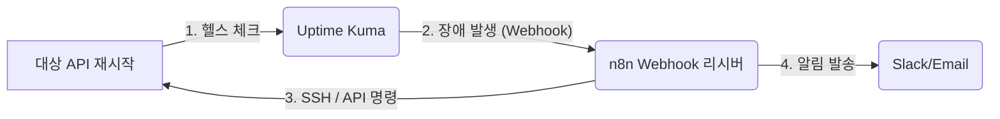

# API 헬스 체크 & 자동 복구 시스템 (Health Check & Auto-Recovery)

이 프로젝트는 **사내 API의 상태를 24시간 모니터링**하고, 장애 발생 시 **자동으로 복구(재시작 등)**하는 시스템을 구축하기 위한 프로젝트입니다.

## 🏗 아키텍처 (Architecture)
"감시"와 "행동"을 분리한 구조를 사용합니다:
- **👀 눈 (The Eyes) - Uptime Kuma:** API가 살아있는지 24시간 감시하고 시각화합니다.
- **✋ 손 (The Hands) - n8n:** 장애 알림을 받으면 스크립트를 실행하여 서비스를 복구합니다.



## 🚀 설치 및 실행 (Installation)

### 1. 전제 조건 (Prerequisites)
- **모든 리눅스 환경 (Ubuntu, CentOS, Debian 등)**
- Windows WSL2 (Ubuntu)
- **Docker & Docker Compose**가 필수로 설치되어 있어야 합니다.
    - [Docker 공식 설치 가이드](https://docs.docker.com/engine/install/)

### 2. 빠른 시작 (Quick Start)
터미널에서 아래 명령어를 순서대로 실행하세요:

```bash
# 서비스 실행
# (권한 에러 발생 시 'newgrp docker' 입력 또는 sudo 사용)
docker compose up -d
```

### 3. 접속 주소 (Service Access)
설치가 완료되면 브라우저에서 아래 주소로 접속하세요.

| 서비스 | URL | 초기 설정 |
|--------|-----|-----------|
| **Uptime Kuma** | [http://localhost:3001](http://localhost:3001) | 관리자 계정 생성 필요 |
| **n8n** | [http://localhost:5678](http://localhost:5678) | 관리자 계정 생성 필요 |

---

## ⚙️ 연동 가이드 (Configuration)

### 1단계: n8n 설정 (받는 쪽)
1. **n8n**([http://localhost:5678](http://localhost:5678))에 접속합니다.
2. 새 워크플로우(Workflow)를 생성합니다.
3. **Webhook** 노드를 추가합니다.
    - **Method:** `POST`
    - **Path:** `webhook` (기본값 추천)
    - 상단에 있는 **Test URL**을 복사해둡니다.
4. **[Execute Node]** 버튼을 눌러 "Listening..." 상태로 대기시킵니다.

### 2단계: Uptime Kuma 설정 (쏘는 쪽)
1. **Uptime Kuma**([http://localhost:3001](http://localhost:3001))에 접속합니다.
2. 우측 상단 프로필 클릭 -> **설정 (Settings)** -> **알림 (Notifications)** 이동.
3. **[알림 설정 (Setup Notification)]** 버튼 클릭.
    - **Type:** `Webhook` 선택
    - **Post URL:** 아까 복사한 n8n URL 붙여넣기
    - **Content Type:** `JSON` 선택
4. **[테스트 (Test)]** 버튼을 클릭합니다.
    - 성공 시 n8n 화면에 초록색으로 데이터가 들어오는 것을 확인할 수 있습니다.

### 3단계: 자동 복구 로직 예시
n8n에서 Webhook 노드 뒤에 다음과 같은 로직을 연결할 수 있습니다:
- **If 노드:** 메시지 내용이 "Down"인지 확인.
- **SSH 노드:** 서버에 접속하여 `docker restart my-api-container` 명령어 실행.
- **Slack 노드:** "API가 죽어서 재시작했습니다" 라고 팀 알림 발송.

## 🛠 문제 해결 (Troubleshooting)

### Q. Docker 권한 오류 (`permission denied`)
설치 직후 권한 그룹이 적용되지 않아서 발생합니다. 다음 명령어를 입력하거나 **터미널을 껐다 켜세요.**
```bash
newgrp docker
```

### Q. n8n과 Kuma가 통신이 안 돼요
두 컨테이너는 `docker-compose.yml`에 의해 같은 네트워크 안에 있습니다.
만약 서로 통신이 안 된다면 URL을 `localhost` 대신 `http://n8n:5678` 또는 `http://host.docker.internal:5678`로 변경해 보세요.
